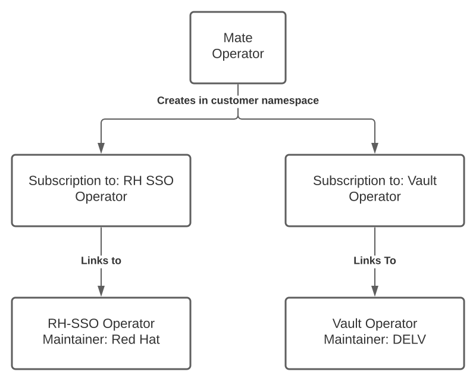

# Mate Operators

The Mate operators will be used to deploy Mate into a customers Kubernetes namespace. The operators will be built using the Ansible plugin for Operator-SDK to provide a declarative management approach. 

A CRD (probably multiple) will be used to provide configuration data for the Mate deployment.

The Mate operator will leverage the existing RH SSO operator provided by RedHat on the operator hub.

A custom operator will need to be build for HashiCorp vault as one does not currently exist. Management of the Vault operator and Mate operator will be decoupled.

# RoadMap

## High level Operator end state goal

The end state goal is a description of what the operators for Mate would look like if it was to be called 'complete'.

- What input information is required?
- Are the external prerequisites (Existing LDAP, DNS)?
    - Customer has an existing OCP environment
    - Identity service exists and is accessible for RH SSO to communicate with
- What are the steps required to deploy in full
    - Operator does.....

## Operator Milestone 1

**Goals**
- Deploy an instance of RH SSO into a specified namespace
- Deploy appropriate Roles
- Leverage existing RH SSO
- Integration with OLM

**Status**
- Creates CRD `matedeploys.deploy.delv.com` used to provide configuration for mate deployment
- Operator watches for `matedeploys.deploy.delv.com` and creates a `subscription.operators.coreos.com/v1alpha1` in the specified namespace
- The subscription deploys an unconfigured instance of RH SSO into the specified namespace

**TODO**
- Integrate with OLM
- Add shell script to clone KeyCloak CRD's from GitHub so they are deployed up front

## Operator Milestone 2

**Goals**
- Convert Hashicorp Vault deployment from Helm charts to Operator
- Integrate with OLM
- Validate and publish to Operator repository

**Status**

**TODO**
- Convert Hashicorp Vault deployment from Helm charts to Operator
- Integrate with OLM
- Validate and publish to Operator repository

# RH SSO Operator

## APIs

### Keycloak

Configuration of Keycloak application, creating 

Base configuration includes postgres deployment with service. This is a persistent DB with a PVC defined.

Database username and password are generated if not specified

**CRD Properties of interest:**

| **Property** | **Description** |
| ------------ | --------------- |
| spec.externalAccess | Set to true for route / ingress creation |
| spec.externalDatabase |Set true to use an external database. If true a secret is needed for accessing external DB|
| spec.instances | Number of Keycloak instances to deploy in HA mode. (Default is 1) Does not scale database pods if they are configured |
| spec.podDisruptionBudget | If set to true, the operator will create [odDistruptionBudget for the Keycloak deployment and set its `maxUnavailable` value to 1|
| spec.postgresDeploymentSpec | Resources (Requests and Limits) for PostgresDeployment. |
| spec.storageClassName | Name of the StorageClass for Postgresql Persistent Volume |

### KeycloakRealm

Create and configure Keycloak Realms.

Deployment testing returned an authentication failure error until the Keycloak password was changed back to the original.

**CRD Properties of interest:**

| **Property** | **Description** |
| ------------ | --------------- |
| spec.instanceSelector | Specify which Keycloak instance to connect to |
| spec.realm.id | Realm identifier |
| spec.realm.enabled | Boolean value to disable / enable the realm |
| spec.realm.displayName | Display name for the realm |

### KeycloakClient

The CR is used to add clients to the deployed instance of Keycloak. A secret is created which contains the Client ID and Secret

**CRD Properties of interest:**

| **Property** | **Description** |
| ------------ | --------------- |
| spec.realmSelector | Set to true for route / ingress creation |
| spec.client.clientID | Client ID |
| spec.client.secret | Authentication secret for client |

### KeycloakUser

### KeycloakBackup

## Additional Notes

### Secrets

*   Keycloak creates a secret for the admin credentials during deploy, keycloak will fail to deploy if this exists.
*   Updating the admin password does not update the credentials-keycloak secret. It appears that this secret is only for the initial credentials.

### High Availability

*   There does not appear to be an option to cluster the postgres DB without using an external DB.